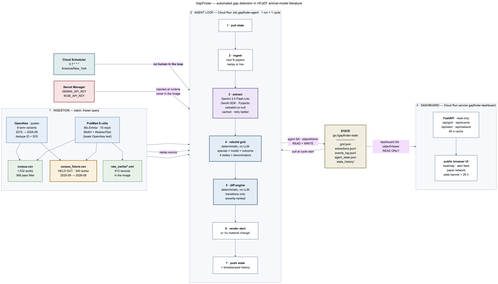

# GapFinder

A stateful literature agent for one narrow field — animal models of heart failure with
preserved ejection fraction (HFpEF). It maintains a coverage map of
**species × disease model × outcome domain** built from PubMed-indexed papers, and
re-derives that map every cycle from the papers it has read. It alerts only when the
map's state changes: a verified gap gets its first paper, two papers start disagreeing
about the same measure, or a cell that held only characterisation studies gains its
first interventional one.

## Why it is different

Existing literature tools answer "what looks similar to this query?" on demand, inferring
gaps from text similarity at the moment you ask. GapFinder computes coverage explicitly
and reports it with a denominator: a cell does not say "under-studied", it says
**"0 of 42 screened"** — 42 papers sat at that species × model pair and none of them
reported that outcome domain. Cells are one of four states, and the difference between
them is the product:

| state | meaning |
|---|---|
| `evidence` | ≥1 paper reports this outcome here |
| `no_evidence_found` | ≥3 papers screened at this species × model pair, none reported this outcome |
| `unscreened` | too few papers at the pair to conclude anything |
| `not_applicable` | the pair cannot exist (e.g. Mouse × ZSF1 — ZSF1 is a rat strain) |

The unit of alerting is a **knowledge-state change**, not a keyword match. The agent runs
unattended on a schedule and holds the previous cycle's map in object storage, so
"what changed" is a diff between two computed maps rather than a re-query.

## Live demo

**https://gapfinder-dashboard-588003694253.us-east1.run.app**

- **grid** — species × model heatmap per outcome domain; evidence cells scale green by
  paper count (√ scale), `no_evidence_found` is amber, `unscreened` gray, `n/a` hatched.
  Click any cell for its papers.
- **alerts** — the latest cycle's events as cards, grouped by type, each showing the new
  paper and the context that makes it meaningful (the two camps of a contradiction; the
  papers whose silence defined a filled gap).
- **open gaps** — current `no_evidence_found` cells ranked by adjacency, each with its
  "0 of N screened" denominator.
- **network** — papers linked by shared model / entities / outcome domains / mechanisms /
  time points, with per-edge-type weight sliders; colour by model, species, or dominant
  outcome domain.
- **paper panel** — any PMID anywhere opens the ingested abstract, the structured
  extraction, the grid cells the paper occupies, and links to PubMed and DOI.

## Architecture



**Ingestion** (batch, run once). `build_corpus.py` queries OpenAlex through `pyalex` with
six frozen HFpEF term variants pinned in `corpus_config.json`, deduplicates by OpenAlex ID
and DOI, then fetches each PMID's PubMed record through `Bio.Entrez`. Raw API responses are cached under `raw_cache/`,
which is not committed to the repository (~150 MB); `build_corpus.py` regenerates it. PubMed supplies both
the MeSH layer (publication types, species descriptors, chemicals, qualifiers, major
topics) and the abstract text. Papers dated after the corpus cut-off go to a separate
held-out file used for replay.

**What gets extracted.** Each outcome carries a `domain`, a verbatim `measure`, a
`direction`, and — since the v4 schema — a `comparator` saying *what was compared with
what*: `vs_healthy_control` (sick animals against healthy), `vs_untreated_disease`
(treated against untreated sick animals, with the `agent` named), `vs_other_subgroup`
(one group against another, with a `subgroup_axis` of sex / genotype / age), or
`vs_baseline`. Papers also record `sexes_studied` and `genotypes_studied`. Half of all
multi-outcome papers (194 of 396) mix comparators in a single abstract — the model
characterisation and the drug rescue are different questions, and the schema keeps them
apart.

**Agent loop** (`agent_loop.py`, Cloud Run Job `gapfinder-agent`). One invocation is one
cycle: pull the previous state from GCS, ingest the next batch of papers, extract
structured fields with Gemini through the GenAI SDK, rebuild the grid deterministically,
diff it against the previous grid, render an alert, push the new state plus a timestamped
history entry. Only the extraction step uses a model; the grid and the diff are ordinary
code, so the same inputs always produce the same map.

**State** (`gs://gapfinder-state`). `grid.json`, `extractions.jsonl`, `events_log.jsonl`,
`agent_state.json`, and `state_history/` (a timestamped grid + alert per cycle). Nothing
mutable lives in the container image; nothing in the image is written at runtime.

**Secrets** (Secret Manager). `GEMINI_API_KEY` and `NCBI_API_KEY` are injected into the job
at runtime. `.env` is the first line of `.dockerignore` and `.gcloudignore`, so keys reach
neither the image nor the Cloud Build staging bucket.

**Dashboard** (`dashboard/`, Cloud Run service `gapfinder-dashboard`). FastAPI, read-only,
60-second cache over the state bucket, with a single-file frontend. It runs as a dedicated
service account, `gapfinder-dashboard-sa`, holding **`roles/storage.objectViewer` on the
state bucket only** — no project-level roles and no write capability. There are no write
endpoints; the agent job owns all state.

## Stack

| requirement | used for |
|---|---|
| Gemini 3.5 Flash-Lite via Google GenAI SDK | per-abstract structured extraction (Pydantic response schema) |
| Cloud Run Job | the daily agent cycle |
| Cloud Run Service | the dashboard |
| Cloud Scheduler | `0 7 * * *` America/New_York, triggers the job |
| Cloud Storage | all cycle state and history |
| Secret Manager | both API keys |
| Cloud Build | both images |
| Artifact Registry | image hosting |

## Validation and honesty

**The replay is genuinely held out.** The corpus is frozen at 2015-01-01 → 2025-08-31.
Papers from 2025-09-01 → 2026-08-24 were pulled into a separate file, `corpus_future.csv`
(340 works, 75 passing the standard filter), and were never seen when the grid was built.
Replay cycles feed them in publication order, so every alert in the demo comes from a real
paper the system had not read. Zero OpenAlex-ID overlap between the two files.

**A data-quality bug that produced confidently wrong records.** OpenAlex reconstructs
abstracts from an inverted index, and that reconstruction silently drops text. Comparing
the 478 papers where both an OpenAlex reconstruction and a PubMed abstract exist:
29 (6.1%) lose more than 10% of the PubMed abstract's words, 21 (4.4%) more than 25%, and
19 (4.0%) more than half. The worst case in the corpus loses 82%.

This was not a fill-rate problem — it was a wrong-answer problem. Paper 38363584 was
missing 66.7% of its abstract. The extraction it produced was well-formed and plausible:

```
disease_model  before: combination ["elevated blood pressure", "obesity", "exercise intolerance"]
               after : combination ["angiotensin II", "high-fat diet"]
arms           before: ["correction of hypertension", "normalization of the diet",
                        "introduction of voluntary exercise"]
               after : ["voluntary exercise"]
outcomes       2 -> 5
```

Before the fix the model described the animals' *phenotype* as the induction method,
because the methods text was absent. The pipeline now prefers PubMed `<AbstractText>` and
falls back to OpenAlex only when no PubMed record exists. Re-running the same 10
hand-selected papers with the same model on repaired abstracts moved 43/60 → 47/60 filled
fields, but the fill-rate change understates it: the important corrections were records
that were already non-empty and wrong.

**`not_applicable` caught a real bug on its first run.** Marking impossible species × model
pairs surfaced 14 cells holding 8 papers — Mouse × ZSF1, Mouse × Dahl, Mouse × SHR. All
were multi-species papers tagged `Mice; …; Rats, Zucker` where first-match species
assignment picked Mouse while the model was a rat strain. Species resolution now picks the
first species compatible with the assigned model; 8 papers were re-filed and the impossible
count is zero. Without that fourth state the error would have stayed invisible.

**Extraction fill rates** — as of the 398-paper snapshot (cycle 3), Gemini 3.5 Flash-Lite,
verbatim-or-null prompt:

| field | filled |
|---|---|
| outcomes | 392/398 (98.5%) |
| disease_model | 375/398 (94.2%) |
| entities | 320/398 (80.4%) |
| mechanisms | 290/398 (72.9%) |
| arms | 251/398 (63.1%) |
| time_points | 238/398 (59.8%) |

2,923 outcomes, 361 arms, 1,248 entity mentions in total.

The dashboard's live numbers supersede this snapshot as daily cycles run.

### What counts as a contradiction

Two papers reporting opposite directions are only in conflict if they asked the same
question. A contradiction therefore requires **the same disease model, the same canonical
measure, the same comparator type, and — for treatment results — the same agent**.
Everything else that points opposite ways is recorded as `divergent_context`: real data,
displayed in the dashboard, never alerted. A drug improving a measure against vehicle does
not contradict the disease model worsening that measure against healthy animals.

Sex and genotype travel with each paper as display context. They may explain why two
results differ, but they never merge or split a group, and they are never used to dismiss
a result.

**Measure clustering.** Verbatim measure phrases fragment badly: `diastolic dysfunction`,
`diastolic function`, `E/A ratio`, `E/e' ratio` and `LV end-diastolic pressure` are one
concept under five names. All **1,857 distinct phrases in the corpus were clustered into
108 canonical measures**, stored in `grid_config.py` as `MEASURE_GROUPS` — a hand-editable
canonical→members map, with a diagnostic that prints unmapped phrases and near-duplicate
canonical names on every build. Contradiction keys use the canonical measure; the verbatim
strings are kept in `measure_variants` for display.

Counts at 428 papers, as the rules tightened:

| rule | contradiction | divergent_context | within_paper |
|---|---|---|---|
| interventional-only, verbatim measures | 45 | — | 44 |
| + comparator partitioning, verbatim measures | 2 | 243 | 7 |
| + measure clustering | 18 | 820 | 18 |
| + duplicate merges and coarse-bucket exclusions | **16** | **780** | **15** |

### Three false positives an expert caught

The contradiction logic was rebuilt three times, each time because a domain expert read
the output and pointed at something wrong. The sequence is the validation story:

1. **`other-combination / histological / cardiomyocyte hypertrophy`** — MCC950 improving
   hypertrophy was flagged against an iron-deficiency paper worsening it. One tested a
   drug, the other described a disease. This produced the interventional /
   characterisation split.
2. **The same case survived that fix**, because the iron-deficiency paper listed
   `Compound C` — an AMPK-inhibitor tool compound — in its `arms`, so it looked
   interventional. A paper-level flag could not settle an outcome-level question. This
   produced the per-outcome `comparator` field.
3. **`db/db / cardiac / diastolic dysfunction`** — three papers flagged as one
   disagreement turned out to be three different comparisons: empagliflozin vs vehicle,
   aldosterone-treated db/db vs healthy, and female vs male. All three now separate
   cleanly.

None of these were found by a metric. Fill rates were high and stable throughout.

### Known limits

- **`arms` undercounts.** 361 arms across 251 papers is ~1.4 per paper, low for an
  interventional literature; multi-arm studies are being collapsed to a primary
  intervention. This held steady across the abstract repair, so it is a prompt/schema
  limit, not a data limit.
- **`direction` is per-measure, not per-intervention.** Counts are near-balanced
  (improved ≈ worsened), because the field captures both "the model worsened X" and "the
  drug improved X". To read a treatment effect, join `direction` against `arms` being
  non-empty. The contradiction detector already splits cross-paper disagreements from
  same-paper both-ways entries for this reason.
- **The mechanism slider is close to inert.** Mechanisms are free-text sentences, so exact
  matching after normalisation almost never collides — 14 shared counts across 4,000
  candidate edges. It needs clustering to be useful.
- **The network edge set is truncated.** 398 papers give ~79k pairs; feature values shared
  by more than 120 papers are suppressed and the candidate set is capped at 4,000 edges.
  The API returns `truncated: true` and the UI says so rather than implying completeness.
- **Half the corpus has no PMID.** 769 of 1,532 works (50.2%) carry one. The rest are
  preprints, conference abstracts, and non-MEDLINE items with no MeSH layer, so they can
  never satisfy the species filter. 143 works (9.3%) have no abstract from either source.
- **Most of the grid is `unscreened`.** At 1,200 cells and ~400 papers, the majority of
  cells lack the ≥3 papers needed to call anything. Splitting the model axis from 10 to 20
  values increased resolution and decreased density. `MIN_SCREENED` in `grid_config.py` is
  the dial.
- **Drug-vs-drug contradictions are effectively undetectable at this corpus size.** Only
  2 of 1,269 `(model, domain, measure, agent)` groups contain more than one paper: two
  papers testing the *same* agent, in the *same* model, on the *same* canonical measure is
  a rare coincidence at 428 papers. None of the 16 surviving contradictions are
  `vs_untreated_disease`. This is a corpus-size constraint, not a logic error — the rule is
  correct and will start firing as the corpus grows.
- **`protein_expression` and `gene_expression` are excluded from contradiction keys.**
  Those two buckets hold 171 and 83 verbatim phrases covering unrelated molecules, so
  "protein expression went up here and down there" is not a disagreement. Outcomes in them
  still count as evidence in the grid and still display; they are barred only from forming
  contradiction keys, via `MEASURE_EXCLUDE_FROM_CONTRADICTION` in `grid_config.py`.
- **`arms` conflates the treatment under test with any compound administered.** A tool
  compound used in one sub-experiment makes a characterisation paper look interventional.
  The `comparator` field routes around this per outcome, but proper per-outcome arm
  attribution — which arm does this specific result belong to — is future work.
- **Cycle stamping is new.** Extraction records written before it carry no `cycle` field,
  so "new this cycle" falls back to first-appearance in the event log for those. The API
  reports `n_stamped` / `n_unstamped` so the UI never implies more precision than it has.

## Reproduce it

```bash
git clone https://github.com/sslone04/gapfinder.git && cd gapfinder
python3 -m venv .venv
.venv/bin/pip install -r requirements.txt

cat > .env <<'EOF'
GEMINI_API_KEY=...     # aistudio.google.com/apikey
NCBI_API_KEY=...       # ncbi.nlm.nih.gov/account/settings (raises E-utilities to 10 req/s)
EOF
```

Build the corpus, extract, build the grid, then run a cycle:

```bash
.venv/bin/python build_corpus.py                     # OpenAlex + PubMed -> corpus.csv, corpus_future.csv
                                                     # ~10 min cold; everything is cached to raw_cache/
GEMINI_MODEL=gemini-3.5-flash-lite \
  .venv/bin/python run_extraction.py --rate-gap 6    # prints the call estimate and asks before spending
                                                     # add --yes to skip the prompt, --limit N to sample
.venv/bin/python build_grid.py                       # grid.json + printed summary
.venv/bin/python agent_loop.py --replay-batch 10     # one cycle against the held-out set
.venv/bin/python agent_loop.py --replay-batch 10 --dry-run   # same, writes no state
```

Every LLM response is cached under `gemini_cache/` keyed by model + schema version +
prompt, so re-runs cost nothing and an interrupted run resumes where it stopped.

Deploy:

```bash
gcloud auth login
./deploy.sh              # bucket, secrets from .env, Cloud Build, Cloud Run Job, Scheduler
./deploy_dashboard.sh    # dashboard image, Cloud Run service, read-only SA, prints the URL
```

Both scripts print every `gcloud` command before running it and abort on the first failure.

## Roadmap (deliberately not built)

- **Live-ingest MeSH wiring.** The non-replay path pulls OpenAlex works updated since the
  last cycle but stops short of filling the MeSH layer; it needs
  `build_corpus.parse_pubmed` wired in.
- **Per-outcome arm attribution**, so each result names the arm it came from; this also
  fixes the `arms` undercount.
- **Mechanism clustering**, the same treatment measures received, to make that axis and
  its network slider meaningful.
- **Labelled community detection** in the paper network, so clusters are named rather than
  just drawn.
- **Config swap to a second field.** The field-specific knowledge is confined to
  `corpus_config.json` (the query) and `grid_config.py` (species, model, and outcome axes);
  nothing else in the pipeline mentions HFpEF.

## Costs

Built inside the $150 Google Cloud credit. Per cycle the measurable units are: 10 Gemini
3.5 Flash-Lite calls (one per new paper, ~2k input tokens each), one Cloud Run Job
execution of roughly 3–5 minutes at 1 vCPU / 2 GiB, and a few MB of GCS reads and writes —
cents per cycle. The one-time build cost was the 368-paper backfill extraction. Exact
figures were not read from the billing console; these are measured call counts and
runtimes, not a billing export.
